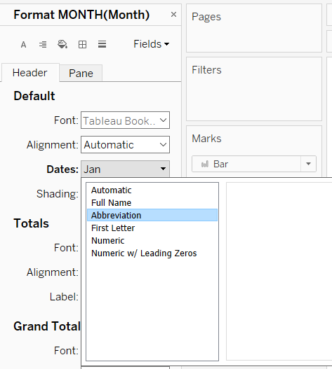

```{r setup, include=FALSE}
knitr::opts_chunk$set(echo = FALSE)
```

# 1. Critique of Original Data Visualisation


The original data visualisation above is created from the data extracted from the Department of Statistics, Singapore (DOS), showing the Merchandise Trade of the Top Six Trading Countries, 2019-2020. The original visualisation is then evaluated for its clarity and aesthetics as follows. 

## 1.1. Clarity

S/N | Critiques | Suggestions 
-- | ---------------- | ----------------
1 | **Data visualisation is inconsistent with the title** – The title says "Merchandise Trade of Top Six Trading Countries, 2019-2020" but for Japan, only the 2020 trade is reflected. | Ensure that the data visualisation for all six countries reflect trade from between 2019 to 2020.
2 | **Unclear y-axis labels** - The y-axes are labelled as "Export" and "Import" respectively but they do not tell us if the numbers are reflecting trade volume or trade value. | Change the y-axes labels to include units: *Export (in $000's)* and *Import (in $000's)*. 
3 | **Axis labels are not consistent** - Hong Kong's import y-axis label is reflected in *thousands* whereas the rest of the y-axes labels are in *millions*. | Standardise all the y-axes labels to *millions*.
4 | **No source is provided** - Without the source, we cannnot tell where the data is taken from. | Include a caption of the source at the bottom of the visualisation.

## 1.2. Aesthetics

S/N | Critiques | Suggestions 
-- | ---------------- | ----------------
1 | **Axis markers are too light to be seen**. | Darken the axis markers slightly so that they can be seen yet aren't too dark and distracting.
2 | **Area chart may not be the most appropriate chart to use** - The import area chart overlays the export area chart totally, making it difficult to see the export area chart. | Change the chart type to a line graph instead to better visualise the time series data. 
3 | **Top bottom alignment of the charts makes it difficult to compare the trade value across countries**. | Suggest to have one chart showing the consolidated line graphs of each country's exports and another chart showing the consolidated line graphs of each country's imports for a better comparison across countries.
4 | **Location of the legend** - There are white spaces below the legend. | Shift the location of the legend to the bottom of the visualisation. 


# 2. Proposed Design

Based on the critics raised above, an alternative graphical presentation has been sketched out to improve the current design. 


## 2.1. Advantages of the Proposed Design

The advantages of the proposed design are as follows:

### Clarity

S/N | Design | Advantages 
-- | ---------------- | ----------------
1 | **Clear title and subtitle** | Title reflects the merchandise trade of each individual country from 2019 to 2020. The subtitle will have a short description defining the concept of "merchandise trade" for clearer understanding. 
2 | **Axes are properly labeled** | The y-axis is properly labeled with standardised tick marks to reflect trade value and the x-axis is labeled to depict time by months.  
3 | **Commentary on observations are inserted above the charts** | A short paragraph describing the general observations noted from the charts can help to summarise what the charts are showing.
4 | **A bar graph showing trade balance is created in addition to the export and import line graphs** | A bar chart showing negative or positive trade value can better showcase the financial health of each country.
4 | **Source is added to the bottom right of the visualisation** | Inclusion of the source will allow readers to easily know where the data is extracted from.

### Aesthestics

S/N | Design | Advantages 
-- | ---------------- | ----------------
1 | **Visible major axis markers are used**. | Major axis markers are added and positioned properly to add a more refined look to the charts. 
2 | **Colour is carefully utilised** | For the line graphs showing different trade values for different countries, a colour is assigned to each country for better visualisation.
3 | **Annotations are added on the graph** | Annotations help to pick out note-worthy trends observed at different time frames that would be useful for further analysis.
4 | **Legend is placed at the bottom left of the visualisation** | A legend is added to reflect which coloured line correspond to which country as it will be too cluttered to include the country names on the line graph itself.

# 3. Proposed Visualisation

The alternative static visualisation is created using Tableau Desktop and is uploaded onto Tableau Public [here](https://public.tableau.com/app/profile/connie.xia/viz/MerchandiseTradebyCountry/MerchandiseTradebyCountry).

# 4. Step-by-step Guide

## 4.1. Data Used

Two data sources are used which are available under the sub-section of [Merchandise Trade by Region/Market](https://www.singstat.gov.sg/find-data/search-by-theme/trade-and-investment/merchandise-trade/latest-data) on the DOS website.The two datasets are then all downloaded in Excel.

## 4.2. Data Preparation

After opening the file in Excel, we can see that there are three sheets: Content, T1 and T2. The *Content* sheet is basically a content page for the datasets found in the Excel file. T1 shows all *Merchandise Imports By Region/Market, Monthly* and T2 shows all *Merchandise Exports By Region/Market, Monthly*. These two sheets are then renamed as *Imports* and *Exports* respectively for clearer identification. The *Content* sheet can now be deleted. 

Under the *Imports* sheet, data cleaning is conducted to only retain information pertinent to the six countries and time period depicted in the original visualisation.

1. Remove all unnecessary and empty rows. Delete Rows 1 to 5, 127 to 140. 


2. Delete rows that do not belong to Hong Kong, Mainland China, Japan, Malaysia, Taiwan and the United States.


3. Delete columns that do not fall within the range of 2019 Jan to 2020 Dec. Only retain Columns SX to TU. 


4. Rename Cell A1 from "Variables" to "Country".

5. Rename Cells A2 to A7 to "Malaysia", "Japan", "Hong Kong", "Taiwan", "Mainland China" and "United States" respectively.

6. Repeat Steps 1 to 5 for the *Exports* sheet as well. 

7. Save the Excel file as *Merchandise Trade by Country*.

8. Import the Excel file into Tableau Desktop for further data cleaning. 

9. Drag and drop the Export sheet into the data pane. 


10. Notice that the data type for the Export values are all in *String* form. Change that to *Numerical* data type. 


11. The Export values from 2019 Jan to 2020 Dec are illustrated in many columns, but we would like the time series data to be spread across rows instead. Hence, select the columns from 2019 Jan to 2020 Dec, right click and pivot.


12. Rename the new headers of the pivoted table to "Month" and "Export (in $000's)" respectively.


13. Change the data type of the *Month* column from *String* to *Date*.


14. Once done, export the data as csv and rename it as *Exports_Pivoted*.


15. Repeat steps 9 to 14 for the *Imports* sheet and name the new csv file as *Imports_Pivoted*.

16. Open the two csv files in Excel and join them by *Country* and *Month* so that the Export and Import values are in the same csv file.


17. Create a new column *Net Exports (in $000's)* in Column E and calculate the *Net Exports* by subtracting the Import value from the Export value.


18. Save and rename the csv file as *Trade_Pivoted*.

19. Import the *Trade_Pivoted* csv file back into Tableau for data visualisation. 

## 4.3. Data Visualisation

1. Inspect the imported data to ensure that all the data types are correct. *Month* should be in Date format and the *Exports (in $000's)*, *Imports (in $000's)* and *Net Exports (in $000's)* are in Numerical format. 

2. Click into a new Sheet and rename "Sheet 1" to "Exports".

3. Create a line chart by dragging *Month* and *Exports (in $000's)* into *Columns* and *Rows* respectively.


4. Change the discrete *Year(Month)* in the column to show continuous *Month(Month)* instead.


5. Drag and drop *Country* into the *Color* tab. 


6. Rename the *Title* to *Exports by Country*.


7. Reduce the line thickness of the line chart under the *Size* tab.


8. Edit the **y-axis** by right clicking on the y-axis and selecting *Edit Axis*. Under the *General* tab, set a fixed range from *0* to *8,500,000*. Under the *Tick Marks* tab, set fixed major tick marks with the *Tick interval = 1,000,000*.


9. Edit the **x-axis** by right clicking on the x-axis and selecting *Edit Axis*. Under the *General* tab, set a fixed range from *1/1/2019* to *1/12/2020* and uncheck the *Show times* box. Rename the *Axis Title* to *Month*. Under the *Tick Marks* tab, set fixed major tick marks with *Tick origin* starting on *1/3/2019*, with *Interval = 3* and *Unit* set to *Months*.


10. Format the **y-axis** by right clicking on the y-axis and selecting *Format*. Under *Scale*, select the *Ticks* dropdown box and choose a darker shade of grey so that the major tick marks are visible on the graph. Repeat the step to format the **x-axis** as well. 


11. Add *Axis Rulers* to both the y-axis and x-axis under the *Format Lines* section, *Rows* and *Columns* tabs, respectively.


12. The final **Exports chart** would look like this:


13. Duplicate the *Exports* Sheet and rename the sheet to *Imports*.

14. Remove *Exports (in $000's)* from the *Rows* and replace with *Imports (in $000's)*.


15. Rename the *Title* to *Imports by Country*.

16. Edit the **y-axis** by right clicking on the y-axis and selecting *Edit Axis*. Under the *General* tab, set a fixed range from *0* to *7,000,000*. Under the *Tick Marks* tab, set fixed major tick marks with the *Tick interval = 1,000,000*.


17. The final **Imports chart** would look like this:


18. Create a new *Sheet* and rename it as *Trade Balance*.

19. Drag *Month* into *Columns* and make sure to show the discrete *Year* and *Month*. Drag *Country* and *Net Exports (in $000's)* into *Rows*.


20. Change the chart type from *Line* to *Bar* under the *Marks* section.


21. Change the display setting at the top of the page from *Standard* to *Entire View* to ensure that the bar chart is fitted nicely on the page.


22. Drag and drop the *Net Exports (in $000's)* into the *Color* tab.


23. Edit the colour scheme to only show 2 colours: *Blue* for positive values and *Red* for negative values by indicating *2 steps* under *Stepped Color*. Under *Advanced* settings, set the *Center* to 0. 


24. Increase the size of the bars under the *Size* tab to decrease the gaps between each bars.


25. Edit the **y-axis** by right clicking the y-axis and select *Edit Axis*. Choose *Independent axis ranges for each row or column* under the *General* tab. 

Right click on the y-axis and select *Format*. Under *Scale*, select the *Ticks* dropdown box and choose a darker shade of grey so that the major tick marks are visible on the graph.


26. Format the **x-axis** by right clicking the x-axis and select *Format*. Under *Date*, choose *Abbreviation* to shorten the length of the months.



27. The final **Trade Balance chart** would look like this:


28. A new dashboard is created to combine the three charts together, A title "Merchandise Trade by Country, 2019-2020" is added at the top. Descriptions of observations are added in text above the charts, with annotations added on the charts as well, and the legend for the *Exports* and *Imports* charts is added at the left bottom of the dashboard. A text box with the *Source* is added to the right bottom of the dashboard. The finalised dashboard would look like this:


# 5. Major Observations Derived

The three major observations derived from new data visualisation are as follows:

1. Overall, **China** has the highest merchandise export and import values. Yet over the period of December 2019 to January 2020, there is a strong decrease in both exports and imports value, from approximately $7M to $4M and $6.4M to $4M, respectively before showing some recovery in March 2020.

2. All six countries experienced in a fall in import value from January 2019 to Februrary 2019 in varying degrees. Similar for export value, only **China** saw a rise in export value over the same time frame.

3. Over the two-year period, **Hong Kong** is constantly having stable trade surplus whereas **Taiwan** is constantly in stable trade deficit. **Malaysia** starts to be in constant trade deficit in 2020 and **US** is seeing positive trade balance from the 2nd quarter of 2020, after being in trade deficit for 5 quarters straight.